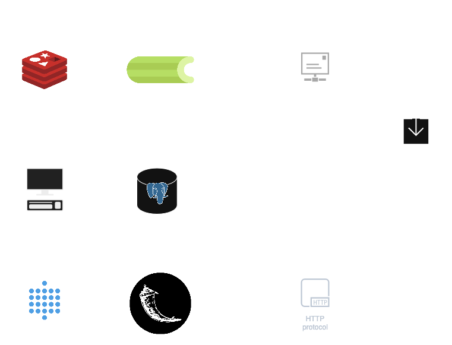

# COMPSCI 564 Final Project: C2 Server

## Overview

A Command & Control server for managing a malware campaign and bot net.

**Features:**

- CLI to manage implants, targets, groups of targets, phishing emails, scheduled and repeated tasks, and data exfiltration
- Vulnerability agnostic
- Send templated spear phishing emails to targets or groups of targets
- Dashboard to interact with C2 database: Search, filter, update targets/tasks/collected data

## Threat Model

- [CVE-2018-16858](https://cve.mitre.org/cgi-bin/cvename.cgi?name=CVE-2018-16858)
- **Vulnerable Software**: LibreOffice (before 6.0.7/6.1.3) and Apache OpenOffice
- **Operating Systems**: Windows, macOS, and Linux
- **Primary Targets**:
  - Enterprise environments with document sharing workflows
  - Government agencies processing external documents
  - Educational institutions with collaborative document use

[CVE-2018-16858](https://cve.mitre.org/cgi-bin/cvename.cgi?name=CVE-2018-16858) is a remote code execution vulnerability in LibreOffice and Apache OpenOffice that allows attackers to execute arbitrary Python code through specially crafted documents.

When a victim opens a malicious document and interacts with certain elements (like form controls), embedded Python scripts execute with the victim's privileges due to inadequate script validation and sandboxing.

The impact includes unauthorized code execution, potential data theft, and system compromise. Mitigation involves updating software, disabling macros/scripts, and avoiding documents from untrusted sources.

This vulnerability is particularly dangerous because office documents are commonly shared and often considered trustworthy.

## Malicious Attachment and Implant

The exploits are enabled by specially crafted .fdot LibreOffice documents. These malicious documents, sent as attachments to the target emails, contain hyperlinks which execute python functions within the LibreOffice macros. We exploit this behavior to by executing commands on the target device with a call to os.system. When opened, the files will first execute a command to download the implant from a public GitHub repository (with a shortened, obfuscated url) and second, add a command to run the implant to the systems bash profile causing it the implant to run whenever the user logs into their computer. This can all be done without any warnings or output on the target system.

The implant is a compiled Go executable. It is lightweight, modular, and capable of executing commands received from the C2 server. Its functionality includes a "kill" mechanism to delete the implant from the target if needed. When it is running, it continuously tries to connect to the C2 server, read commands, execute those commands, and send the output back to the C2.

## Communication Protocol

The C2 server and implants communicate over HTTP/HTTPS using custom headers to ensure that the communication is not detected by firewalls or intrusion detection systems. Header values are base64 encoded.

## Command & Control Server

### Componets

- C2 Flask App: A web application for implants to connect to get commands and update a commands status
- C2 CLI: A command line interface for managing implants, targets, groups of targets, phishing emails, scheduled and repeated tasks, and data exfiltration.
- Celery: A task queue for executing tasks asynchronously. Such as emails or scheduled tasks.
- PostgreSQL: A database for storing data.
- Metabase: A dashboard for interacting with the C2 database: search, filter, update targets/tasks/collected data.
